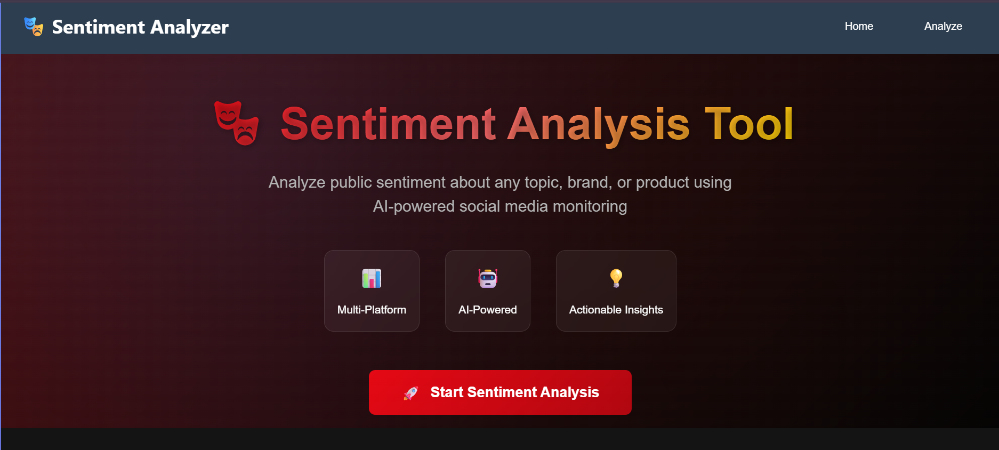
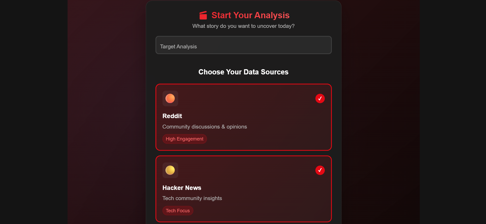
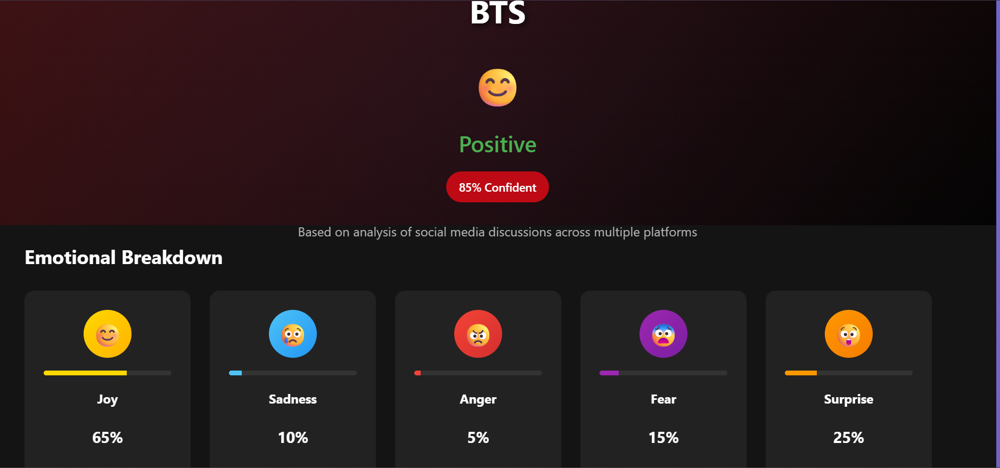

# 🎭 AI-Powered Sentiment Analysis Tool

A full-stack application that analyzes public sentiment about any topic, brand, or product using social media data and Google Gemini AI.

## ✨ Features

- **Multi-Platform Data Collection**: Reddit, Hacker News, Mastodon
- **AI-Powered Analysis**: Google Gemini Pro for advanced sentiment understanding
- **Emotion Detection**: Joy, Sadness, Anger, Fear, Surprise analysis
- **Business Insights**: Actionable recommendations and insights
- **Modern UI**: Responsive Angular frontend with beautiful visualizations
- **Real-Time Processing**: Live sentiment analysis with confidence scoring

## 🚀 Tech Stack

### Frontend
- **Angular 18+** with Standalone Components
- **TypeScript**
- **Modern CSS** with responsive design
- **RxJS** for reactive programming

### Backend
- **NestJS** (Node.js framework)
- **Google Gemini AI** integration
- **TypeScript**
- **RESTful API** design

### Data Sources
- Reddit Public API
- Hacker News Algolia API
- Mastodon Public API
---
## 📸 **Application Screenshots**

### 🎯 **Complete User Journey**

<div align="center">

#### 🏠 Landing Page - Sentiment Analysis 



#### ⚡ Processing State 



---

#### 📊 Analysis Results - Comprehensive Sentiment Dashboard



</div>
## 🛠️ Installation & Setup

### Prerequisites
- Node.js 18+
- npm or yarn
- Google AI API Key

### Backend Setup
```bash
cd backend
npm install
```

Create `.env` file:
```env
GOOGLE_AI_API_KEY=your_gemini_api_key_here
PORT=3000
```

Start backend:
```bash
npm run start:dev
```

### Frontend Setup
```bash
cd frontend
npm install
ng serve
```

## 🎯 Usage

1. **Navigate** to `http://localhost:4200`
2. **Enter** any topic, brand, or product name
3. **Select** data sources (Reddit, Hacker News, Mastodon)
4. **Click** "Analyze Sentiment"
5. **View** comprehensive sentiment analysis with:
   - Overall sentiment score
   - Emotion breakdown
   - Key insights
   - Business recommendations

## 📊 Example Analysis

**Input**: "Tesla"
**Output**:
- **Sentiment**: 87% Positive
- **Emotions**: Joy 65%, Fear 20%, Surprise 25%
- **Insights**: Strong enthusiasm for autopilot technology
- **Recommendations**: Emphasize technology value in marketing

## 🌟 Key Features

### AI-Powered Analysis
- Advanced sentiment classification
- Multi-dimensional emotion detection
- Context-aware processing
- Business intelligence generation

### Modern Architecture
- Microservices design
- RESTful APIs
- Reactive frontend
- Type-safe development

### Scalable & Efficient
- Free API integrations
- Optimized AI prompts
- Responsive design
- Error handling & fallbacks

## 📈 Future Enhancements

- [ ] Historical sentiment tracking
- [ ] More social media platforms
- [ ] Sentiment trend analysis
- [ ] Export reports functionality
- [ ] User authentication
- [ ] Dashboard with analytics

## 🤝 Contributing

1. Fork the repository
2. Create feature branch (`git checkout -b feature/amazing-feature`)
3. Commit changes (`git commit -m 'Add amazing feature'`)
4. Push to branch (`git push origin feature/amazing-feature`)
5. Open Pull Request

## 📄 License

This project is licensed under the MIT License.

## 👨‍💻 Developer

Created with ❤️ by [Malu2003](https://github.com/Malu2003)

---

⭐ Star this repository if you found it helpful!
