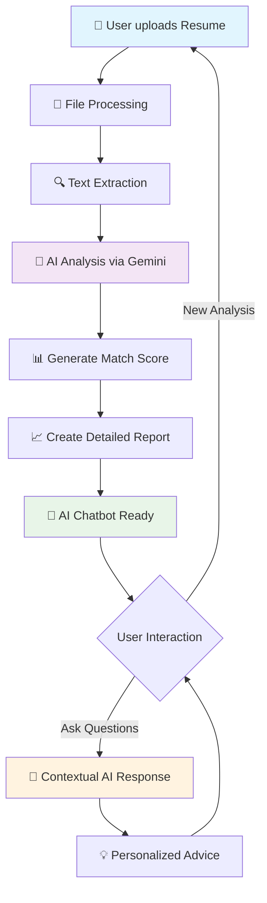
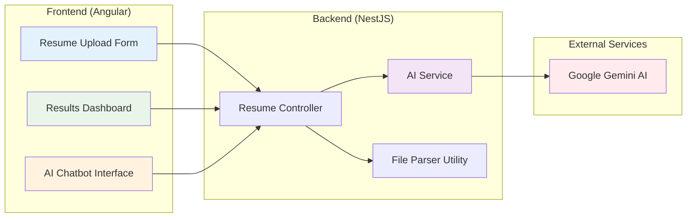
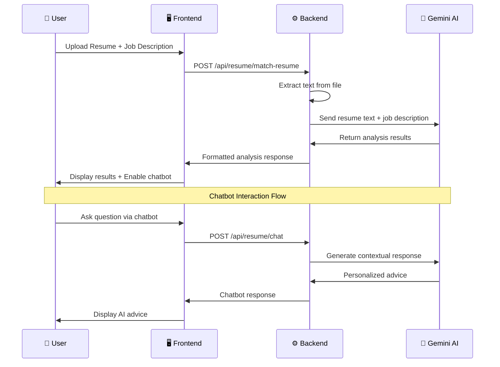
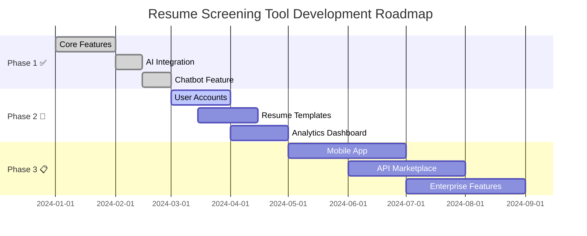

# 🎯 Resume Screening Tool with AI Chatbot

<div align="center">


**A powerful, AI-driven resume analysis tool that helps job seekers optimize their resumes for better job matches.**

Built with Angular, NestJS, and Google's Gemini AI.

[](https://github.com/Malu2003/resume-screening)
[](https://angular.io)
[](https://nestjs.com)
[](https://www.typescriptlang.org)
[](https://ai.google.dev)

[🚀 Live Demo](https://your-demo-link.com) • [📖 Documentation](https://github.com/Malu2003/resume-screening/wiki) • [🐛 Report Bug](https://github.com/Malu2003/resume-screening/issues) • [✨ Request Feature](https://github.com/Malu2003/resume-screening/issues)

</div>

---

## 🎭 **How It Works - Application Flow**



## 🏗️ **System Architecture**



## 🔄 **Data Flow Diagram**



---

## ✨ **Features Showcase**

<table>
<tr>
<td width="50%" valign="top">

### 🔍 **Smart Resume Analysis**
- 🎯 **AI-Powered Matching**: Uses Google Gemini AI for intelligent resume-job matching
- 📊 **Match Score Calculation**: Get a precise compatibility score (0-100%)
- 🔑 **Keyword Analysis**: Identifies matched and missing keywords
- 💪 **Strengths & Improvements**: Detailed feedback on resume strengths and areas for improvement

</td>
<td width="50%" valign="top">

### 💬 **Interactive AI Chatbot**
- 🎯 **Personalized Advice**: Ask specific questions about your resume analysis
- ⚡ **Real-time Responses**: Get instant, contextual career advice
- ❓ **Follow-up Questions**: Smart suggestions for deeper insights
- 🚀 **Resume Optimization Tips**: Actionable recommendations for improvement

</td>
</tr>
<tr>
<td width="50%" valign="top">

### 📊 **Comprehensive Analytics**
- 🎨 **Visual Match Score**: Color-coded scoring system
- 📈 **Detailed Breakdown**: Technical skills, experience, and qualifications analysis
- 🏆 **Priority Recommendations**: High/Medium/Low priority improvement suggestions
- 💼 **Professional Insights**: Industry-standard resume optimization advice

</td>
<td width="50%" valign="top">

### 🎨 **Modern UI/UX**
- 📱 **Responsive Design**: Works perfectly on desktop and mobile
- 🖥️ **Intuitive Interface**: Clean, user-friendly design
- ⏱️ **Real-time Loading**: Smooth animations and progress indicators
- ♿ **Accessibility**: WCAG compliant design

</td>
</tr>
</table>

---

## 🚀 **Quick Start Guide**

### 📋 **Prerequisites**
```bash
✅ Node.js (v18+ recommended)
✅ npm or yarn
✅ Google Gemini API Key
```

### 1️⃣ **Clone the Repository**
```bash
git clone https://github.com/Malu2003/resume-screening.git
cd resume-screening-tool
```

### 2️⃣ **Backend Setup**
```bash
cd backend
npm install

# Create environment file
echo "GEMINI_API_KEY=your_gemini_api_key_here" > .env
echo "PORT=3000" >> .env
```

### 3️⃣ **Frontend Setup**
```bash
cd ../frontend
npm install
```

### 4️⃣ **Start the Application**
```bash
# Terminal 1: Start Backend
cd backend && npm run start:dev

# Terminal 2: Start Frontend  
cd frontend && ng serve
```

### 5️⃣ **Open Your Browser**
Navigate to **http://localhost:4200** 🎉

---

## 🛠️ **Technology Stack**

<div align="center">

| **Frontend** | **Backend** | **AI & APIs** |
|:---:|:---:|:---:|
|  |  |  |
|  |  |  |
|  |  |  |

</div>

---

## 📁 **Project Structure**

```
🏗️ resume-screening-tool/
├── 🖥️ frontend/                    # Angular Application
│   ├── 📂 src/
│   │   ├── 📂 app/
│   │   │   ├── 📂 components/
│   │   │   │   ├── 📄 resume-form/        # File Upload Component
│   │   │   │   ├── 📊 results/            # Analysis Results Display
│   │   │   │   └── 💬 chatbot/            # AI Chatbot Interface
│   │   │   ├── 🔧 services/               # Angular Services
│   │   │   └── 📝 models/                 # TypeScript Interfaces
│   │   └── 🎨 assets/                     # Static Assets
│   └── 📦 package.json
├── ⚙️ backend/                     # NestJS Application
│   ├── 📂 src/
│   │   ├── 📂 resume/                     # Resume Analysis Module
│   │   │   ├── 🎮 resume.controller.ts
│   │   │   ├── 🔧 resume.service.ts
│   │   │   └── 📦 resume.module.ts
│   │   ├── 🤖 services/
│   │   │   └── 🧠 ai.service.ts           # Gemini AI Integration
│   │   └── 🛠️ utils/
│   │       └── 📄 file-parser.util.ts     # File Processing Utilities
│   └── 📦 package.json
├── 📖 README.md
├── 🚫 .gitignore
└── 📄 LICENSE
```


---

## 🎮 **Usage Examples & Screenshots**

### 1️⃣ **Upload Resume**
```
📄 Select your resume file (PDF, DOC, DOCX)
📝 Paste the job description  
🚀 Click "Analyze Resume"
⏳ Wait for AI analysis (typically 10-15 seconds)
```

### 2️⃣ **View Results**
```
📊 Get detailed match score and visual analytics
💪 Review strengths and improvement areas
🔍 Check keyword analysis and gap identification
📈 See priority-ranked recommendations
```

### 3️⃣ **Chat with AI**
```
💬 Click "Ask Questions" button
❓ Ask specific questions like:
   • "Why did I get this match score?"
   • "How can I improve my technical skills section?"
   • "What should I focus on first?"
   • "Can you explain the missing keywords?"
```

---

## 🔐 **Environment Setup**

Create `.env` file in backend directory:

```env
# 🔑 Required - Get from Google AI Studio
GEMINI_API_KEY=your_gemini_api_key_here

# ⚙️ Optional Configuration
PORT=3000
NODE_ENV=development
MAX_FILE_SIZE=10485760  # 10MB in bytes
ALLOWED_FILE_TYPES=pdf,doc,docx
CORS_ORIGIN=http://localhost:4200

# 📊 Rate Limiting (Optional)
RATE_LIMIT_WINDOW=15  # minutes
RATE_LIMIT_MAX=100    # requests per window
```

---


### **Development Workflow**
```bash
# 1️⃣ Fork the repository
git clone https://github.com/YOUR_USERNAME/resume-screening.git

# 2️⃣ Create feature branch
git checkout -b feature/amazing-feature

# 3️⃣ Make your changes
# ... code changes ...

# 4️⃣ Commit changes
git commit -m '✨ Add amazing feature'

# 5️⃣ Push to branch
git push origin feature/amazing-feature

# 6️⃣ Open Pull Request
```

### **Code Style Guidelines**
- 🎯 Use TypeScript for type safety
- 📝 Follow Angular/NestJS conventions
- 🧪 Write tests for new features
- 📖 Update documentation
- 🚀 Ensure responsive design

---

## 📈 **Roadmap & Future Features**



## 🙏 **Acknowledgments**

<div align="center">

**Special thanks to the amazing open-source community and tools that make this project possible:**

| **🤖 AI & ML** | **🛠️ Frameworks** | **☁️ Services** |
|:---:|:---:|:---:|
| [Google Gemini AI](https://ai.google.dev) | [Angular](https://angular.io) | [GitHub](https://github.com) |
| Machine Learning Community | [NestJS](https://nestjs.com) | [npm](https://npmjs.com) |
| Open Source AI Models | [TypeScript](https://typescriptlang.org) | [Node.js](https://nodejs.org) |

</div>

**Response Time:** Usually within 24 hours ⚡

</div>

---

<div align="center">

## 🌟 **Show Your Support**

</div>